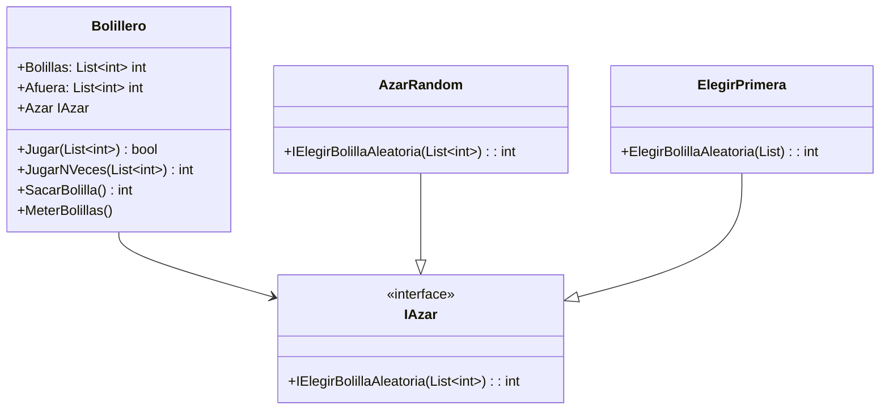

## Documentacion

```mermaid
classDiagram
    class Bolillero{
        +Bolillas: List~int~ int
        +Afuera: List~int~ int
        +Azar IAzar
        +Jugar(List~int~) bool
        +JugarNVeces (List~int~) int
        +SacarBolilla() int
        +MeterBolillas()
    }
    class IAzar{
        <<interface>>
        +IElegirBolillaAleatoria(List~int~): int
    }
    class AzarRandom{
        +IElegirBolillaAleatoria(List~int~): int
    }
    class ElegirPrimera{
        +ElegirBolillaAleatoria(List<int>): int
    }
    Bolillero --> IAzar
    AzarRandom --|> IAzar
    ElegirPrimera --|> IAzar

    
```